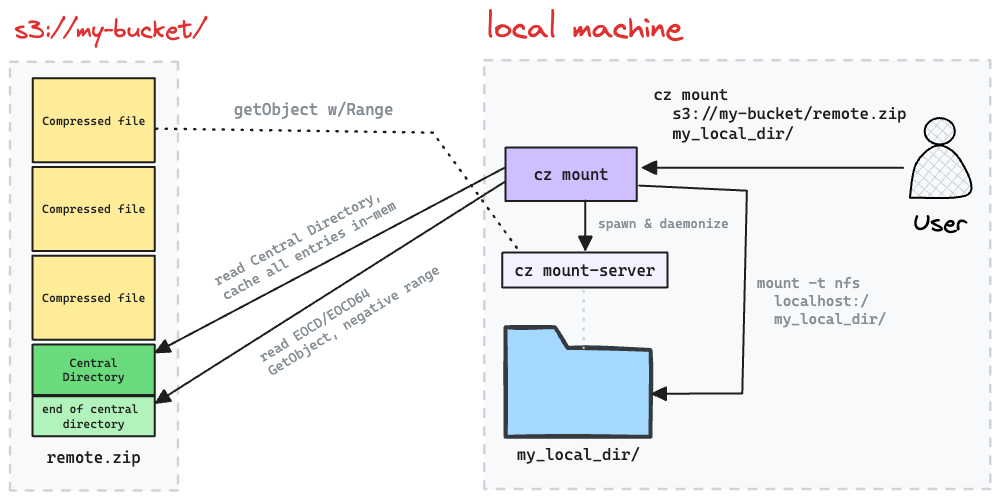

# cz - Cloud Zip

list and get specific files from remote zip archives without downloading the whole thing 

> [!TIP]
> **New:** Experimental support for mounting a remote zip file as a local directory. See [mounting](#%EF%B8%8F-experimental-mounting) below.

## Installation

Clone and build the project (no binaries available atm, sorry!)

```shell
git clone https://github.com/ozkatz/cloudzip.git
cd cloudzip
go build -o cz main.go
```

Then copy the `cz` binary into a location in your `$PATH`

```shell
cp cz /usr/local/bin/
```

## Usage

Listing the contents of a zip file without downloading it:

```shell
cz ls s3://example-bucket/path/to/archive.zip
```

Printing a summary of the contents (number of files, total size compressed/uncompressed):

```shell
cz info s3://example-bucket/path/to/archive.zip
```

Downloading and extracting a specific object from within a zip file:

```shell
cz cat s3://example-bucket/path/to/archive.zip images/cat.png > cat.png
```

Mounting (See below):

```shell
cz mount s3://example-bucket/path/to/archive.zip some_dir/
```

Unmounting:


```shell
cz umount some_dir
```


## Why does `cz` exist?

My use case was a pretty specific access pattern:

> Upload lots of small (~1-100Kb) files as quickly as possible, while still allowing random access to them

How does `cz` solve this? 

Well, uploading many small files to object stores is hard to do efficiently. 

Bundling them as a large object
and using [multipart uploads](https://docs.aws.amazon.com/AmazonS3/latest/userguide/mpuoverview.html) to parallelize the upload while retaining bigger chunks is the most efficient way.

While this is commonly done with `tar`, the [tar format](https://www.loc.gov/preservation/digital/formats/fdd/fdd000531.shtml) doesn't keep an index of the files included in it. 
Scanning the archive until we find the file we're looking for means we might end up downloading the whole thing.

Zip, on the other hand, has a [central directory](https://en.wikipedia.org/wiki/ZIP_(file_format)), which is an index! It stores paths in the archive and their offset in the file. 

This index, together with [byte range requests](https://developer.mozilla.org/en-US/docs/Web/HTTP/Range_requests) (supported by [all](https://docs.aws.amazon.com/whitepapers/latest/s3-optimizing-performance-best-practices/use-byte-range-fetches.html) [major](https://learn.microsoft.com/en-us/rest/api/storageservices/specifying-the-range-header-for-blob-service-operations) [object stores](https://cloud.google.com/storage/docs/samples/storage-download-byte-range)), allow reading a small file(s) from large archives without having to fetch the entire thing!

We can even write a zip file directly to remote storage without saving it locally:

```shell
zip -r - -0 * | aws s3 cp - "s3://example-bucket/path/to/archive.zip"
```

#### but what about CPU usage? Won't compression slow down the upload?

Zip files don't have to be compressed! `zip -0` will result in an uncompressed archive, so there's no additional overhead.

## How Does it Work?

#### `cz ls` 

Listing is done by issuing 2 [HTTP range requests](https://developer.mozilla.org/en-US/docs/Web/HTTP/Range_requests):

1. Fetch the last 64kB of the zip file, looking for the End Of Central Directory ([EOCD](https://en.wikipedia.org/wiki/ZIP_(file_format)#End_of_central_directory_record_(EOCD))), and possibly [EOCD64](https://en.wikipedia.org/wiki/ZIP_(file_format)#ZIP64). 
2. The EOCD contains the exact start offset and size of the [Central Directory](https://en.wikipedia.org/wiki/ZIP_(file_format)#Central_directory_file_header), which is then read by issuing another HTTP range request

Once the central directory is read, it is parsed and written to `stdout`, similar to the output of `unzip -l`.

#### `cz cat` 

Reading a file from the remote zip involves another HTTP range request: once we have the central directory, we find the relevant entry for the file we wish to get, and figure out its offset and size. This is then used to issue a 3rd HTTP range request.

Because zip files store each file (whether compressed or not) independently, this is enough to uncompress and write the file to `stdout`.

#### ⚠️ Experimental: `cz mount`

Instead of listing and downloading individual files from the remote zip, you can now mount it to a local directory.

```shell
cz mount s3://example-bucket/path/to/archive.zip my_dir/
```

This would show up on your local filesystem as a directory with the contents of the zip archive inside it - as if you've downloaded and extracted it.

However... behind the scenes, it would fetch only the file listing from the remote zip (just like `cz ls`) and spin up a small NFS server, listening on localhost, and mount it to `my_dir/`.

When reading files from `my_dir/`, they will first be downloaded and decompressed on-the-fly, just like `cz cat` does.

These files are downloaded into a cache dir, which if not explicitly set, will be purged when unmounted.
To set it to a specific location (and retain it across mount/umount cycles), set the `CLOUDZIP_CACHE_DIR` environment variable:

```shell
export CLOUDZIP_CACHE_DIR="/nvme/fast/cache"
cz mount s3://example-bucket/path/to/archive.zip my_dir/
```

To unmount:

```shell
cz umount my_dir
```

which will unmount the NFS share from the directory, and terminate the local NFS server for you.

#### Mounting, illustrated:



#### Demo

Mounting a 32GB dataset, directly from Kaggle's storage (See Kaggle usage below) as a local directory,
with DuckDB reading a single file with ~1 second load time:


> [!CAUTION]
> This is still experimental (and only supported on Linux and MacOS for now)


## Logging

Set the `$CLOUDZIP_LOGGING` environment variable to `DEBUG` to log storage calls to stderr: 

```shell
export CLOUDZIP_LOGGING="DEBUG"
cz ls s3://example-bucket/path/to/archive.zip  # will log S3 calls to stderr
```

## Supported backends

### AWS S3

Will use the default [ AWS credentials resolution order](https://docs.aws.amazon.com/sdk-for-go/v1/developer-guide/configuring-sdk.html#specifying-credentials)

Example:

```shell
cz ls s3://example-bucket/path/to/archive.zip
```

### HTTP / HTTPS

Example:

```shell
cz ls https://example.com/path/to/archive.zip
```

### Kaggle

Kaggle's [Dataset Download API](https://github.com/Kaggle/kaggle-api/blob/db7f8d24871b999f48e9b5a42104dc3364259193/src/KaggleSwagger.yaml#L502) returns an URL for a zip file, so we can use it easily with `cz`!
Before getting started, generate an API key and store the json file in `~/.kaggle/kaggle.json` (see ["Authentication"](https://www.kaggle.com/docs/api#authentication) on the Kaggle API docs).

Alternatively, you can store the `kaggle.json` in a different location and set the `KAGGLE_KEY_FILE` environment variable with its path. 

Example:

```shell
cz ls kaggle://{userSlug}/{datasetSlug}
```

For example, for the dataset at `https://www.kaggle.com/datasets/datasnaek/youtube-new`, the `cz` url should be `kaggle://datasnaek/youtube-new`.


### lakeFS

Since [lakeFS](https://github.com/treeverse/lakeFS) can return pre-signed URLs which are HTTP(s), we can simply do:

```shell
lakectl fs presign lakefs://repository/ref/archive.zip | cz ls -
```

> [!WARNING]
> A note about pre-signed URLs and mounts: Since pre-signed URLs have a relatively short expiration, mounting them could lead to some undefined behavior. Typically, this would require a mechanism to "refresh" them, requesting a new url from the server. This is currently not yet implemented for lakeFS 


### Local files

Prefix the path with `file://` to read from the local filesystem. Can accept either relative path or absolute path.

Example:

```shell
cz ls file://archive.zip  # relative to current directory (./archive.zip)
cz ls file:///home/user/archive.zip  # absolute path (/home/user/archive.zip)
```
